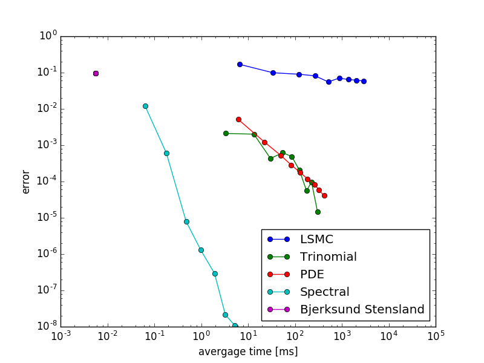

# Fast American Option Pricing
## What is this project about?
This project is an implementation of american option pricing based on integral equation form. Taking advantage of exponentianl convergence of spectral method, this algorithm is about 6 orders of magnitude faster than the traditional finite difference method at comparable or better accuracy levels. The main steps of this algorithm are listed as follows:
1. compute collocation points
2. compute coefficients for Gaussian quadrature
3. compute QD+ algorithm for initial guess: QDplusAmericanOptionSolver.py
4. Newton iteration to find exercise boundary
5. compute option price using the exercise boundary

## How to use the solver?
The main solver is FastAmericanOptionSolverA.py and FastAmericanOptionSolverB.py. Solver A is much faster than Solver B, while Solver B is more stable in some cases. The users are recommended to follow the steps in testA.py and testB.py for testing.
CrankNicolsonOptionSolver.py is a solver for American put option pricing and can be used independently or to compare with the spectral method. EuropeanOptionSolver.py is a solver for Europea option pricing. It is a component of the spectral method, but can also be used independently. Other tests are self-documented. Please feel free to contribute to this project.

## How fast is the solver?
Comparing with the traditional trinomial tree and PDE method, the spectral method is about 6 orders of magnitude faster at comparable accuracy. The speed of the python version actually depends on the compiler. Without using JIT compiler, the spectral method takes about 1s per pricing. When I implement the code in c#, the pricing is 100 times faster. However, I can not share the code here since it is in production. You can get a sense based on the following figure:

## About the paper
The algorithm is based on paper Leif Andersen, High Performance American Option Pricing, 2015, but the author only considered the put option. The code in this repository has already considered both call and put cases.
